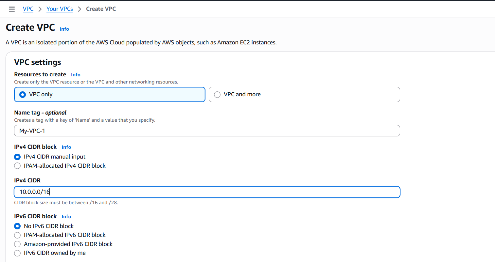
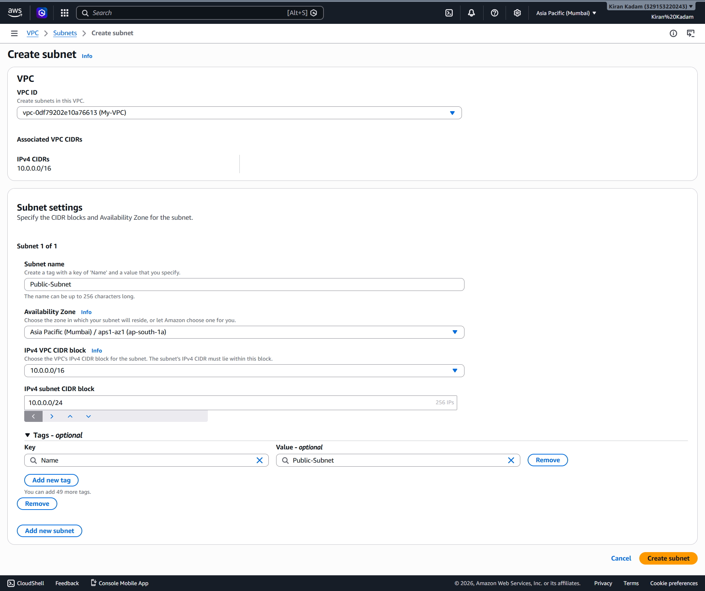
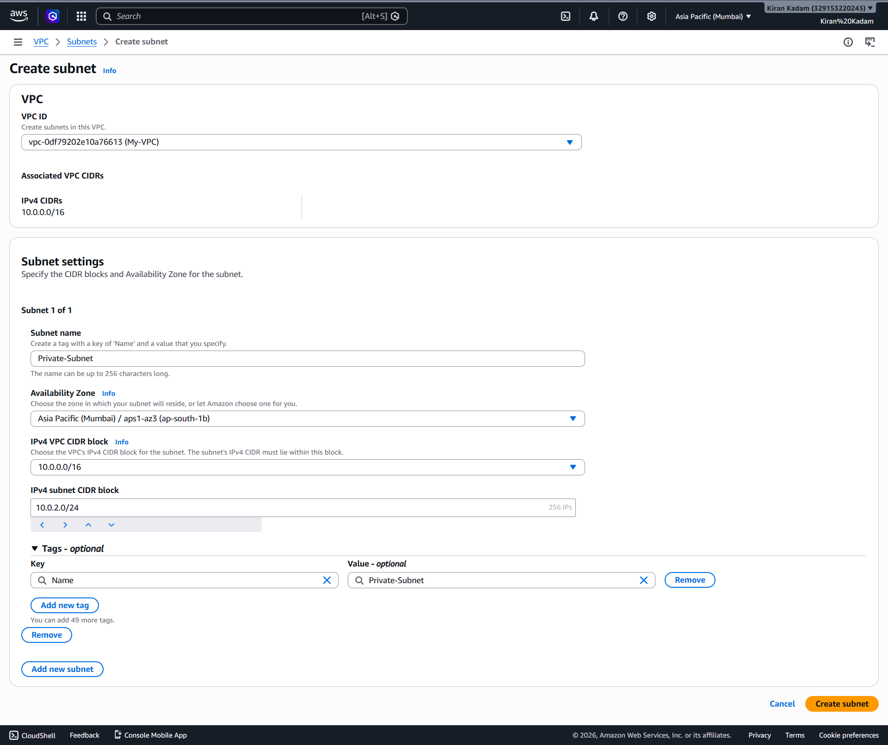
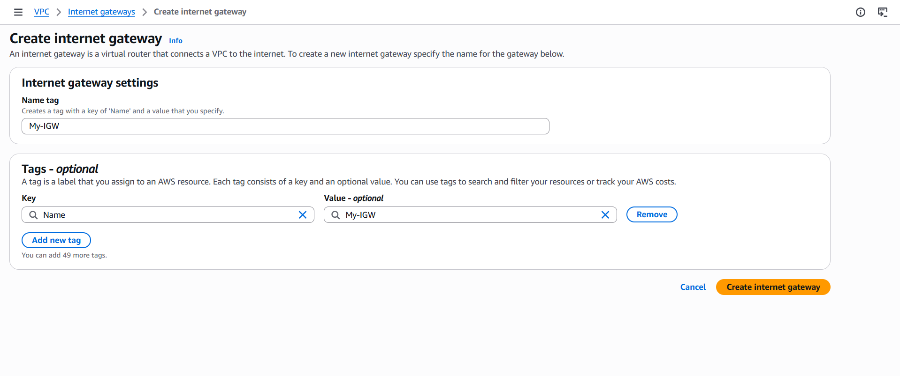
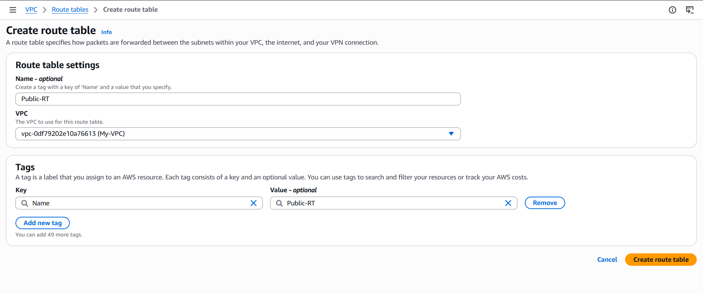
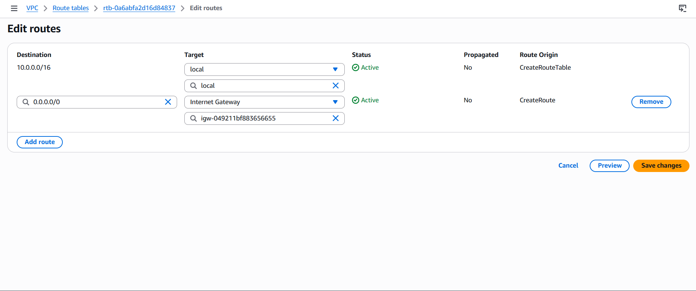
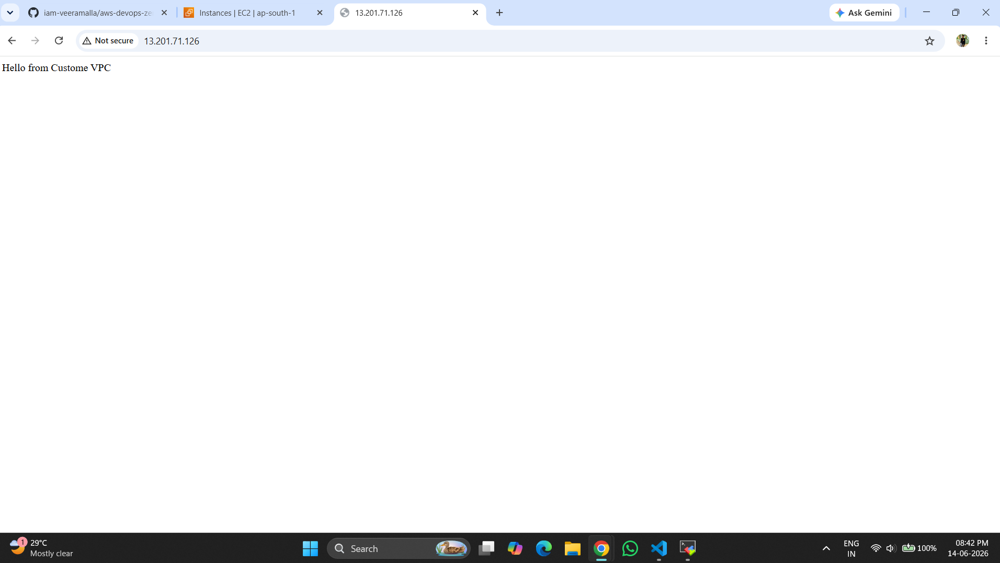

# Create Custom VPC Lab

## Objective

In this lab, you will learn how to:

* Create a Custom VPC
* Create Public and Private Subnets
* Create an Internet Gateway (IGW)
* Create Route Tables
* Associate Route Tables
* Launch EC2 in Public Subnet
* Verify Internet Connectivity
* Understand VPC Architecture

---

# Architecture

```text
Internet
    │
    ▼
Internet Gateway
    │
    ▼
VPC (10.0.0.0/16)
    │
    ├── Public Subnet
    │      └── EC2 Instance
    │
    └── Private Subnet
```

---

# Step 1: Create VPC

Navigate:

```text
VPC → Your VPCs → Create VPC
```

Choose:

```text
VPC Only
```

Enter:

```text
Name: My-VPC
IPv4 CIDR: 10.0.0.0/16
```

Click:

```text
Create VPC
```

## Step 1: Create VPC



---

# Step 2: Create Public Subnet

Navigate:

```text
Subnets → Create Subnet
```

Select:

```text
My-VPC
```

Enter:

```text
Subnet Name: Public-Subnet
Availability Zone: ap-south-1a
CIDR Block: 10.0.1.0/24
```

Create Subnet.

## Step 2: Create Public Subnet



---

# Step 3: Create Private Subnet

Create another subnet.

```text
Subnet Name: Private-Subnet
Availability Zone: ap-south-1b
CIDR Block: 10.0.2.0/24
```

Click Create.

## Step 3: Create Private Subnet



---

# Step 4: Create Internet Gateway

Navigate:

```text
Internet Gateways
```

Click:

```text
Create Internet Gateway
```

Name:

```text
My-IGW
```

Create.

## Step 4: Create Internet Gateway



---

# Step 5: Attach Internet Gateway

Select:

```text
My-IGW
```

Click:

```text
Attach To VPC
```

Choose:

```text
My-VPC
```

Attach.

---

# Step 6: Create Public Route Table

Navigate:

```text
Route Tables
```

Create Route Table.

```text
Name: Public-RT
VPC: My-VPC
```

Create route table.

## Step 6: Create Public RT



---

# Step 7: Add Internet Route

Select:

```text
Public-RT
```

Routes → Edit Routes

Add:

| Destination | Target           |
| ----------- | ---------------- |
| 0.0.0.0/0   | Internet Gateway |

Save.

## Step 7: Adding Internet Route



---

# Step 8: Associate Public Subnet

Go to:

```text
VPC
→ Route Tables
→ Public-RT
```
Select:

```text
Subnet Associations
```

Click:

```text
Edit Subnet Associations
```

Check:

```text
Public-Subnet
```

Click:

```text
Save Associations
```

Save.

---

# Step 9: Enable Auto Assign Public IP

Select:

```text
Public-Subnet
```

Actions:

```text
Edit Subnet Settings
```

Enable:

```text
Auto Assign Public IPv4 Address
```

Save.

---

# Step 10: Launch EC2 in Public Subnet

Launch Instance:

```text
Amazon Linux 2023
t2.micro
```

Network:

```text
My-VPC
```

Subnet:

```text
Public-Subnet
```

Enable:

```text
Auto Assign Public IP
```

Security Group:

Allow:

```text
SSH 22
HTTP 80
```

Launch Instance.

---

# Step 11: Verify Connectivity

Connect via SSH.

```bash
ping google.com
```

Expected:

```text
Internet Connectivity Successful
```

---

# Step 12: Test Web Server

Install Apache:

```bash
sudo dnf install httpd -y
```

Start Service:

```bash
sudo systemctl start httpd
```

Enable Service:

```bash
sudo systemctl enable httpd
```

Create Test Page:

```bash
echo "Hello from Custom VPC" | sudo tee /var/www/html/index.html
```

Open Browser:

```text
http://PUBLIC-IP
```

Expected:

```text
Hello from Custom VPC
```

## Step 12: Output



---

# Understanding the Traffic Flow

```text
Browser
   │
   ▼
Internet
   │
   ▼
Internet Gateway
   │
   ▼
Route Table
   │
   ▼
Public Subnet
   │
   ▼
EC2 Instance
```

---