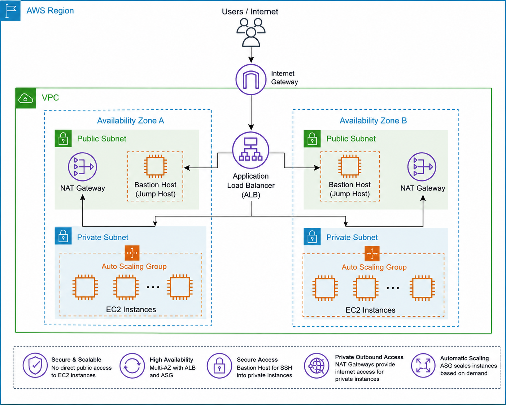

# Project: Deploy Highly Available Web Application on AWS

## Project Overview

This project demonstrates how to build a **highly available**, **scalable**, and **secure** web application architecture on AWS.

The infrastructure is deployed across multiple Availability Zones and uses AWS networking, load balancing, and auto scaling services to ensure high availability and fault tolerance.

This project follows common AWS architecture patterns used in production environments.

---

# Architecture

```text
Users / Internet
        │
        ▼
Internet Gateway
        │
        ▼
Application Load Balancer
        │
   ┌────┴────┐
   ▼         ▼

AZ-A       AZ-B

Public     Public
Subnet     Subnet

│            │
├─ NAT GW    ├─ NAT GW
├─ Bastion   ├─ Bastion
│            │
▼            ▼

Private     Private
Subnet      Subnet

│            │
└─ Auto Scaling Group
      │
      ▼
   EC2 Instances
```

---

## Architecture diagram image



---

# Project Objectives

* Create a custom AWS networking environment.
* Deploy resources across multiple Availability Zones.
* Implement secure access using a Bastion Host.
* Deploy application servers inside Private Subnets.
* Configure an Application Load Balancer.
* Configure Auto Scaling for automatic recovery.
* Understand production-grade AWS architecture.

---

# AWS Services Used

| Service                   | Purpose                                        |
| ------------------------- | ---------------------------------------------- |
| VPC                       | Network Isolation                              |
| Public Subnets            | Internet-facing Resources                      |
| Private Subnets           | Application Servers                            |
| Internet Gateway          | Internet Access                                |
| NAT Gateway               | Outbound Internet Access for Private Instances |
| EC2                       | Application Servers                            |
| Security Groups           | Instance-level Firewall                        |
| Application Load Balancer | Traffic Distribution                           |
| Target Groups             | Backend Instance Registration                  |
| Auto Scaling Group        | Automatic Scaling and Recovery                 |
| Launch Template           | Standardized EC2 Configuration                 |

---

# High-Level Workflow

### 1. Create VPC

Use AWS **VPC and More** to automatically provision:

* VPC
* Public Subnets
* Private Subnets
* Internet Gateway
* Route Tables
* NAT Gateway

---

### 2. Create Security Groups

Create separate security groups for:

* Bastion Host
* Application Load Balancer
* Application Servers

---

### 3. Launch Bastion Host

Deploy a Bastion Host in a Public Subnet.

Purpose:

* Secure administrative access
* SSH access to private resources

---

### 4. Create Launch Template

Define:

* AMI
* Instance Type
* Security Group
* User Data Script

The Launch Template is used by the Auto Scaling Group.

---

### 5. Create Target Group

Register application servers with a Target Group.

The Load Balancer forwards requests to healthy targets.

---

### 6. Create Application Load Balancer

Deploy an Internet-facing Application Load Balancer.

Responsibilities:

* Receive client requests
* Distribute traffic
* Perform health checks

---

### 7. Create Auto Scaling Group

Deploy application instances across:

* Private Subnet A
* Private Subnet B

Auto Scaling automatically:

* Launches new instances
* Replaces failed instances
* Maintains desired capacity

---

### 8. Verify High Availability

Terminate one EC2 instance.

Observe:

* Auto Scaling launches a replacement
* Application remains accessible through ALB

---

# Security Design

### Public Resources

* Application Load Balancer
* Bastion Host
* NAT Gateway

### Private Resources

* Application Servers
* Auto Scaling Instances

### Security Groups

#### Bastion Host

| Port | Purpose |
| ---- | ------- |
| 22   | SSH     |

#### Load Balancer

| Port | Purpose |
| ---- | ------- |
| 80   | HTTP    |
| 443  | HTTPS   |

#### Application Servers

| Port | Source                 |
| ---- | ---------------------- |
| 80   | ALB Security Group     |
| 22   | Bastion Security Group |

---

## Cleanup

Delete resources in this order:

### Delete Auto Scaling Group
Web-ASG
### Delete Launch Template
App-Template
### Delete Load Balancer
Application-ALB
### Delete Target Group
Application-TG
### Terminate Bastion Host
Bastion-Host
### Delete Security Groups
Bastion-SG
App-SG
ALB-SG
### Delete VPC
Production-VPC

---

# Project Structure

```text
Day-07/
│
├── README.md
├── Highly-Available-Web-Application-Lab.md
│
└── screenshots/
    ├── 01-
```

---

# Expected Outcomes

After completing this project, you will understand:

* AWS Networking Fundamentals
* Public vs Private Subnets
* NAT Gateway Usage
* Bastion Host Architecture
* Application Load Balancer
* Launch Templates
* Auto Scaling Groups
* High Availability Concepts
* Self-Healing Infrastructure Design

---

# Author

This project is part of my AWS learning journey and focuses on understanding how production-grade AWS architectures are designed and deployed.

---
